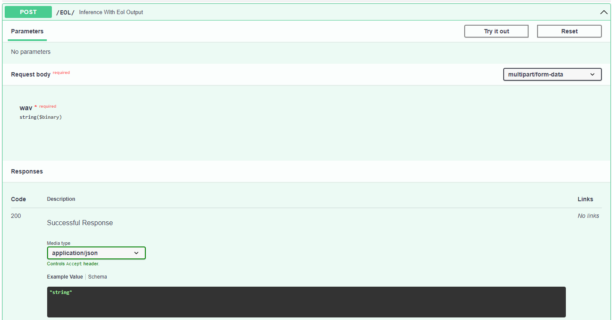
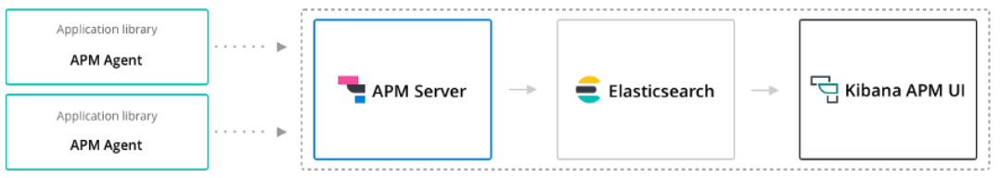

# faursound_core
[](https://github.com/GVSCAL/faursound_core/actions/workflows/pytest.yml)
[](https://github.com/GVSCAL/faursound_core/actions/workflows/codeql-analysis.yml)
[](https://github.com/GVSCAL/faursound_core/actions/workflows/docker-image-with-test.yml)
## install
```python 
conda create --name fs python=3.8
```
```python 
conda activate fs
```
```python
pip install -r requirements.txt
```
note : if issue when installing elastic-apm -> download source file, then install manually with
```python
python setup.py install
```

## FaurSound core functions

see doc, link TBU

## FaurSound REST API


## Monitoring API performance

**Note before start : this set up need 17G+ free RAM in your computer !**

High-Level Architecture :



elasticsearch download & how to , see : https://www.elastic.co/downloads/elasticsearch

APM Server download & how to , see: https://www.elastic.co/downloads/apm

Kibana download & how to , see : https://www.elastic.co/downloads/kibana

## faursound CI
TBU
